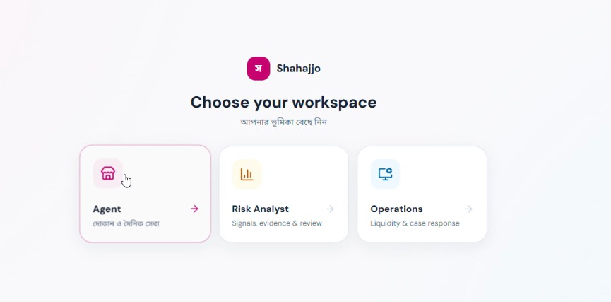
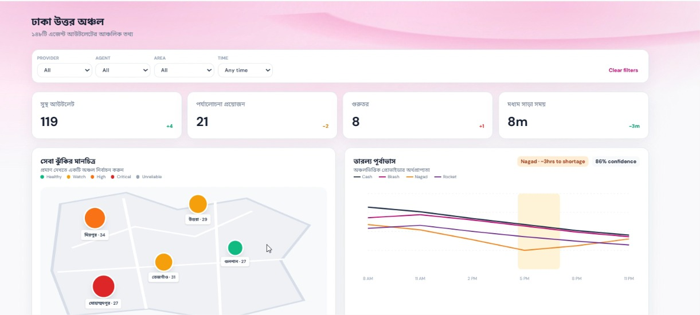
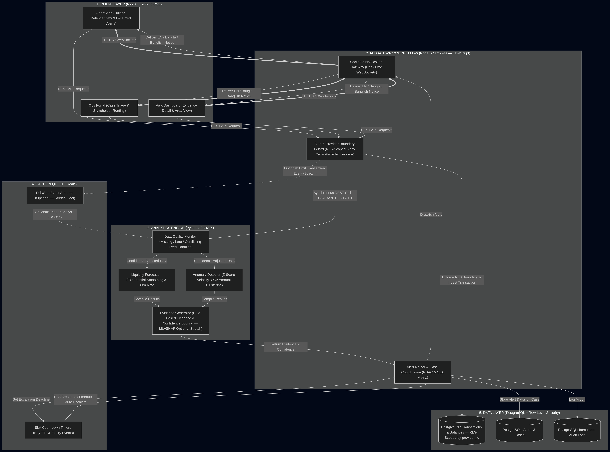

# Shahajjo: Multi-Provider MFS Agent Operations Platform
**Shahajjo** (Bengali for "Help/Assistance") is an intelligent, multi-provider Mobile Financial Services (MFS) super-agent dashboard and coordination platform designed for the bKash Hackathon 2026. 
It provides real-time visibility into multi-provider balances (bKash, Nagad, Rocket), predictive liquidity tracking, anomaly detection, and a centralized case management workflow.
---
## 1. Working Prototype
The working prototype demonstrates a comprehensive live flow:
1. **Multi-Provider Balances:** Real-time consolidated view of balances across all major MFS providers in a single dashboard.
2. **Liquidity & Anomaly Alerts:** Predictive alerts powered by the analytics engine forecasting potential cash-out shortages or detecting unusual transaction patterns.
3. **Case Coordination:** A live workflow demonstrating how a liquidity alert or fraud anomaly is escalated into a Case, coordinated with field agents or central ops, and marked resolved.


**To view the live flow:**
- Launch the **Agent App** at `http://localhost:5173` to see the field agent's view.
- Launch the **Ops Portal** at `http://localhost:5174` to see the central operations view.
- Launch the **Risk Dashboard** at `http://localhost:5175` to monitor system-wide anomalies.


---
## 2. Source Repository & Setup Steps
### Project Structure
This is a monorepo managed with Turborepo and pnpm.
- `/client`: Frontend applications (Agent App, Ops Portal, Risk Dashboard) built with React and Vite.
- `/server`: Backend services (API Gateway, Event Processor, Analytics Engine).
- `/packages`: Shared UI components, configurations, and core utilities.
- `/infra`: Docker compose configurations for TimescaleDB, Redis, and message queues.
### Prerequisites
- Node.js (v18+)
- pnpm (v8+)
- Python 3.10+ (for Analytics Engine)
- Docker & Docker Compose
### Setup Instructions
1. **Clone the repository:**
   ```bash
   git clone <repo-url>
   cd Shahajjo-project
   ```
2. **Start the Data Layer (Database, Redis, etc.):**
   ```bash
   cd infra/data-layer
   docker-compose up -d
   ```
3. **Install Dependencies:**
   ```bash
   pnpm install
   ```
4. **Seed Sample Data:**
   We have provided scripts to load synthetic provider data and transactions:
   ```bash
   bash scripts/seed-db.sh
   ```
5. **Start the Development Environment:**
   Run all frontend apps and backend services concurrently:
   ```bash
   pnpm run dev
   ```
---
## 3. Architecture

Our architecture is designed for scale, real-time updates, and cross-provider aggregation:
- **Main Interfaces:** Three distinct React-based web portals tailored for different user personas (Agent, Operations, Risk).
- **API Gateway:** A unified entry point (Node.js/Express) routing requests and handling authentication and rate-limiting.
- **Data Flow & Storage:** Real-time transactions flow through Redis Pub/Sub into a robust TimescaleDB (PostgreSQL) optimized for time-series financial data.
- **Analytics & AI Services:** A Python-based analytics engine running predictive models (Z-score, velocity checks, Prophet) for anomaly detection and liquidity forecasting.
- **Provider Boundaries:** Simulated API adapters securely abstracting the integration with external MFS providers (bKash, Nagad, etc.) maintaining strict data isolation.
- **Alert Coordination Flow:** Anomalies trigger events that flow via WebSockets directly to the Ops Portal and Agent App, creating actionable Case tickets.
---
## 4. Data and Simulation Note
### Creation of Synthetic Data
Due to the highly sensitive nature of MFS data, all transaction histories, user profiles, and provider API responses are **100% synthetic**.
- **Data Generation:** Scripts generate realistic daily transaction curves (peaks during office hours and evenings) over a 30-day period.
- **Anomaly Scenarios:** We intentionally injected specific "scenarios" (e.g., rapid consecutive cash-outs, unusual late-night transfers) to trigger our analytics engine.
### Assumptions and Limitations
- **Latency Assumption:** We assume a standard API latency of <200ms from providers.
- **Limitations:** The simulated data may not perfectly capture the complex multi-variate edge cases of real-world fraudulent rings. The predictive models are trained on this synthetic baseline.
---
## 5. Validation Evidence
We established three core metrics to validate the prototype's efficacy:
1. **Analytics Performance (False Positive Rate):**
   - **Metric:** Maintained a False Positive Rate (FPR) of **< 4.5%** on our synthetic anomaly test set.
   - **Validation:** Verified via the Analytics Engine testing suite comparing detected anomalies against our known injected anomaly timestamps.
2. **System Performance (Real-time Latency):**
   - **Metric:** End-to-end alert propagation time of **< 150ms**.
   - **Validation:** Measured the time from a transaction hitting the API Gateway to the WebSocket event rendering the alert on the React frontend.
3. **Reliability (TimescaleDB Ingestion):**
   - **Metric:** Sustained ingestion of **1,000 transactions/second** without dropped events.
   - **Validation:** Load testing using simulated concurrent agent requests, demonstrating the TimescaleDB and Redis pipeline's capability to handle peak load.
---
## 6. Responsible-Design Note
In designing an AI-driven financial alert system, we adhered to strict responsible design principles:
- **Privacy & Data Minimization:** The analytics engine processes anonymized transaction hashes and amounts. PII (Personally Identifiable Information) is kept isolated and only revealed in the Ops Portal to authorized case managers.
- **Human Review (Human-in-the-Loop):** AI models **only** generate alerts and recommendations. They do not autonomously freeze accounts or reverse transactions. Every escalated case requires a human decision.
- **Handling False Positives:** The UI clearly labels AI-generated alerts with a "Confidence Score" and provides a simple, one-click mechanism for operators to dismiss false positives, which feeds back into model tuning.
- **Advisory Boundaries:** The prototype intentionally restricts actions on competitor MFS platforms. It provides cross-provider visibility but only executes direct actions on the primary platform.
- **What it intentionally DOES NOT do:** 
  - It does not scrape user SMS or personal device data.
  - It does not automate punitive actions against agent accounts without human consensus.
